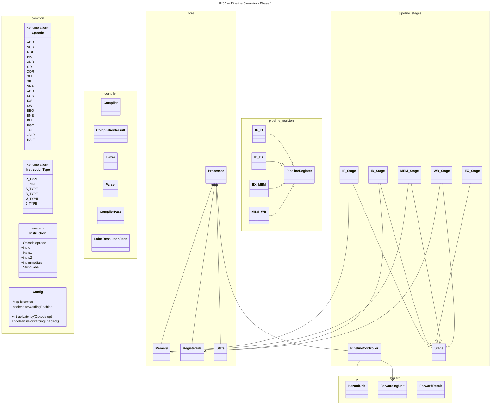

# 🚀 RISC-V Pipeline Simulator

**Phase 1 – Cycle-Accurate 5-Stage Implementation**

A modular, cycle-accurate 5-stage in-order RISC-V pipeline simulator written in Java.  
Designed with clean architectural separation between compilation, core processor, pipeline stages, and hazard resolution logic.

---

## 🧠 Architectural Overview

This simulator models a classic **5-stage RISC-V pipeline**:

```
IF → ID → EX → MEM → WB
```

The system is structured around a central **Processor** and a **PipelineController**, which coordinate stage execution and pipeline register updates on every clock cycle.

### Core Architectural Components

| Component | Responsibility |
|------------|----------------|
| `Processor` | Top-level orchestrator of simulation |
| `PipelineController` | Controls cycle progression, stalls, flushes |
| `Stage` | Abstract base class for all pipeline stages |
| `PipelineRegister` | Base class for inter-stage registers |
| `HazardUnit` | Detects RAW hazards and load-use conditions |
| `ForwardingUnit` | Resolves data dependencies dynamically |
| `ForwardResult` | Encapsulates forwarding decisions |
| `RegisterFile` | 32-register architectural state |
| `Memory` | Unified instruction + data memory |
| `Stats` | Collects performance metrics |

---

## 🏗️ Pipeline Design

### 1️⃣ IF – Instruction Fetch
- Fetches instruction from `Memory`
- Maintains and updates PC
- Writes to `IF_ID`

### 2️⃣ ID – Instruction Decode
- Decodes opcode and operands
- Reads from `RegisterFile`
- Generates control signals
- Performs hazard detection
- Writes to `ID_EX`

### 3️⃣ EX – Execute
- Performs ALU operations
- Computes branch conditions and targets
- Applies forwarding decisions
- Writes to `EX_MEM`

### 4️⃣ MEM – Memory Access
- Executes `LW` / `SW`
- Interacts with `Memory`
- Writes to `MEM_WB`

### 5️⃣ WB – Write Back
- Writes results to `RegisterFile`
- Enforces x0 immutability

---

## 🔄 Pipeline Registers

Each stage boundary is separated by a dedicated pipeline register:

```
IF_ID
ID_EX
EX_MEM
MEM_WB
```

All extend `PipelineRegister` and carry:

- Instruction metadata
- Operand values
- Destination register index
- Control signals
- Computed results
- Valid/bubble state

Pipeline registers are updated simultaneously at every clock edge to preserve hardware-accurate behavior.

---

## ⚠️ Hazard Handling

### 🔹 Data Hazards (RAW)

Handled by:

- `HazardUnit.detectHazard()`
- Automatic stall insertion
- Bubble injection into pipeline

Special handling:
- Load-use hazard detection
- x0 ignored in dependency checks

---

### 🔹 Forwarding

Handled by:

- `ForwardingUnit.resolve(rs1, rs2, EX_MEM, MEM_WB)`
- Priority: `EX_MEM` > `MEM_WB`

`ForwardResult` determines operand source selection in EX stage.

Forwarding can be toggled via configuration.

---

### 🔹 Control Hazards

- Branches resolved in EX stage
- Flush-on-taken strategy
- `PipelineController` triggers:
  - `shouldFlush()`
  - PC redirection
  - Bubble insertion

---

## 🧩 Compilation Pipeline

Before execution, assembly is processed through:

- `Lexer`
- `Parser`
- `LabelResolutionPass`
- `CompilerPass`
- `Compiler`

Produces:

- `CompilationResult`
- Fully resolved instruction list
- Loaded into `Memory`

---

## 📜 Supported Instructions

| Type | Instructions |
|------|-------------|
| 🧮 Arithmetic | `ADD`, `SUB` |
| 💾 Memory | `LW`, `SW` |
| 🌿 Branch | `BNE` |
| 🔀 Jump | `JAL` |

---

## ⚙️ Configuration

Execution parameters are defined in `Config.java`.

Example:

```java
latencies.put(Opcode.ADD, 1);
latencies.put(Opcode.MUL, 2);
forwardingEnabled = true;
```

Configurable features:

- Per-opcode latency
- Forwarding enable/disable
- Memory size
- Pipeline behavior

---

## 📊 Performance Metrics

Collected via `Stats`:

- Total cycles
- Committed instructions
- Stall count
- Flush count
- IPC (Instructions Per Cycle)
- CPI (Cycles Per Instruction)

---

## 📂 Project Structure

```
src/
├── common/              Opcode, Instruction, Config
├── compiler/            Lexer, Parser, Compiler passes
├── core/
│   ├── Processor.java
│   ├── PipelineController.java
│   ├── Memory.java
│   ├── RegisterFile.java
│   └── Stats.java
├── pipeline/
│   ├── Stage.java
│   ├── registers/
│   │   ├── PipelineRegister.java
│   │   ├── IF_ID.java
│   │   ├── ID_EX.java
│   │   ├── EX_MEM.java
│   │   └── MEM_WB.java
│   └── stages/
│       ├── IF_Stage.java
│       ├── ID_Stage.java
│       ├── EX_Stage.java
│       ├── MEM_Stage.java
│       └── WB_Stage.java
└── hazard/
    ├── HazardUnit.java
    ├── ForwardingUnit.java
    └── ForwardResult.java
```

---

## 🏗️ Architecture




## 🛠️ Build & Run

### Compile

```bash
javac -d out src/**/*.java
```

### Run

```bash
java -cp out core.Processor <assembly_file>
```

---

## 🎯 Design Philosophy

This simulator emphasizes:

- Strict separation of architectural layers
- Hardware-accurate cycle simulation
- Clean hazard resolution logic
- Deterministic, traceable pipeline behavior
- Extensibility without structural redesign

---

## 🚀 Future Extensions (Planned)

- Superscalar issue width
- Dynamic scheduling
- Register renaming
- Reorder Buffer (ROB)
- Branch prediction
- Cache simulation
- Multi-cycle functional units

---

### RISC-V Pipeline Simulator – Phase 1

**Cycle Accurate • Modular • Architecturally Faithful**