# 🚀 RISC-V Pipeline Simulator

**Phase 2 – Cache & Pipeline Integration**

A modular, cycle-accurate 5-stage in-order RISC-V pipeline simulator written in Java.  
Designed with clean architectural separation between compilation, core processor, pipeline stages, hazard resolution logic, and variable-latency cache hierarchy.

---

## 🧠 Architectural Overview

This simulator models a classic **5-stage RISC-V pipeline** featuring **BTFNT Branch Prediction** and a complete **Two-Level Set-Associative Cache Hierarchy**:

```
IF → ID → EX → MEM → WB
```

The system is structured around a central **Processor** and a **PipelineController**, which coordinate stage execution and pipeline register updates on every clock cycle.

### Core Architectural Components

| Component | Responsibility |
|------------|----------------|
| `Processor` | Top-level orchestrator of simulation |
| `PipelineController` | Controls cycle progression, stalls, flushes |
| `Stage` | Abstract base class for all pipeline stages |
| `PipelineRegister` | Base class for inter-stage registers |
| `HazardUnit` | Detects RAW hazards and load-use conditions |
| `ForwardingUnit` | Resolves data dependencies dynamically |
| `ForwardResult` | Encapsulates forwarding decisions |
| `RegisterFile` | 32-register architectural state |
| `CacheHierarchy` | L1I, L1D, and unified L2 cache controllers |
| `Memory` | 128KB memory (.text at `0x0000`, .data at `0x0400`) |
| `Stats` | Collects performance and cache metrics |

---

## 🏗️ Pipeline Design

### 1️⃣ IF – Instruction Fetch
- Fetches instruction from `CacheHierarchy` (falls back to `Memory`)
- Maintains and updates PC
- Writes to `IF_ID`

### 2️⃣ ID – Instruction Decode
- Decodes opcode and operands
- Reads from `RegisterFile`
- Generates control signals
- Performs hazard detection
- Writes to `ID_EX`

### 3️⃣ EX – Execute
- Performs ALU operations
- Computes branch conditions and targets
- Applies forwarding decisions
- Writes to `EX_MEM`

### 4️⃣ MEM – Memory Access
- Executes `LW` / `SW`
- Interacts with `CacheHierarchy`
- Writes to `MEM_WB`

### 5️⃣ WB – Write Back
- Writes results to `RegisterFile`
- Enforces x0 immutability

---

## 🚀 Simulation Workflow

The simulator is designed for rapid iteration. Modify your assembly, run the simulation, and inspect results immediately.

### 📥 Input
- **File**: `input.asm`
- **Format**: RISC-V Assembly (subset)
- **Content**: Provide your instructions here. The simulator defaults to `input.asm` if no file is specified.

### 📤 Output
- **Console**: Real-time cycle-by-step logs and performance summary.
- **`console.txt`**: A full log of every cycle's execution for debugging.
- **`output.txt`**: Final simulation statistics (Cycles, Stalls, IPC, etc.).

---

## 🔄 Pipeline Registers

Each stage boundary is separated by a dedicated pipeline register:

```
IF_ID
ID_EX
EX_MEM
MEM_WB
```

All extend `PipelineRegister` and carry:

- Instruction metadata
- Operand values
- Destination register index
- Control signals
- Computed results
- Valid/bubble state

Pipeline registers are updated simultaneously at every clock edge to preserve hardware-accurate behavior.

---

## ⚠️ Hazard Handling

### 🔹 Data Hazards (RAW)

Handled by:

- `HazardUnit.needsStall()`
- Automatic stall insertion
- Bubble injection into pipeline

Special handling:
- Load-use hazard detection
- x0 ignored in dependency checks

---

### 🔹 Forwarding

Handled by:

- `ForwardingUnit.getForwardA()` and `getForwardB()`
- Priority: `EX_MEM` > `MEM_WB`

`ForwardResult` determines operand source selection in EX stage.

Forwarding can be toggled via configuration.

---

### 🔹 Control Hazards

- Static **BTFNT (Backward-Taken, Forward-Not-Taken)** Branch Prediction implemented.
- Branches resolved completely in EX stage.
- Misprediction recovery:
  - Flush-on-mispredict strategy (squashes fetched/decoded instructions).
  - `PipelineController` triggers PC redirection and dynamically handles bubbles automatically.

---

## 🧩 Compilation Pipeline

Before execution, assembly is processed through:

- `Lexer`
- `Parser`
- `LabelResolutionPass`
- `CompilerPass`
- `Compiler`

Produces:

- `CompilationResult`
- Fully resolved instruction list
- Loaded into `Memory`

---

## 📜 Supported Instructions

| Type | Instructions |
|------|-------------|
| 🧮 Arithmetic | `ADD`, `SUB`, `MUL`, `DIV`, `ADDI`, `LI`, `AND`, `OR`, `XOR`, `SLL`, `SRL` |
| 💾 Memory | `LW`, `LB`, `SW`, `SB` |
| 🌿 Branch | `BEQ`, `BNE`, `BLT`, `BGE` (with BTFNT static prediction) |
| 🔀 Jump | `JAL` |
| 🏷️ Pseudo | `LI`, `LA`, `MV`, `NOP` |
| 🛑 System | `ECALL`, `HALT` |

---

## ⚙️ Configuration

Execution parameters are defined in `Config.java`.

Example:

```java
latencies.put(Opcode.ADD, 1);
latencies.put(Opcode.MUL, 2);
forwardingEnabled = true;
```

Configurable features:

- Per-opcode latency
- Forwarding enable/disable
- Memory size
- Pipeline behavior

---

## 📊 Performance Metrics

Collected via `Stats`:

- Total cycles
- Committed instructions
- Stall count
- Flush count
- IPC (Instructions Per Cycle)
- CPI (Cycles Per Instruction)

---

## ⚖️ Architectural Assumptions & Edge Cases

To maintain a cycle-accurate hardware model, the simulator relies on several specific architectural assumptions and edge-case behaviors:

### 1. Register File Write-Back Timing (Half-Cycle Execution)
The `RegisterFile` simulates half-cycle write-first, read-second behavior. Because the simulator ticks stages in reverse order (`WB → MEM → EX → ID → IF`), `WB_Stage` commits its writes to the register file *before* `ID_Stage` reads from it in the same cycle. This ensures that values written in cycle `N` are immediately accessible to instructions decoding in cycle `N` without requiring an explicit forwarding path from WB to ID.

### 2. Branch Resolution & BTFNT Prediction
- Branches are statically predicted in the **ID Stage** using **BTFNT** (Backward branches are predicted Taken, Forward branches predicted Not Taken). If a backward branch is identified, `ID_Stage` eagerly updates the PC.
- Branches are definitively resolved in the **EX Stage**. If the actual outcome diverges from the BTFNT prediction, the EX stage asserts a misprediction.
- A misprediction flushes both the `IF_ID` and `ID_EX` pipeline registers, instantiating a precise **2-cycle penalty**.

### 3. Stall Arbitration & Cache Miss Serialization
- **Pipeline Freezes:** During a cache miss, the entire pipeline is frozen. The simulation loop suspends pipeline register advancement and solely decrements the stall counters.
- **Concurrent Cache Misses:** If both the IF (Instruction) and MEM (Data) stages encounter a cache miss in the exact same cycle, the penalties are **serialized** (MEM miss latency is served first, followed immediately by IF miss latency). This models a shared L2 cache hierarchy with a single arbitrated memory port that prioritizes data requests over instruction fetches.
- **Multi-Cycle EX Operations:** Instructions like `MUL` or `DIV` hold the pipeline by emitting a multi-cycle stall. New instructions are stalled in ID while EX spins down the required latency.

### 4. Instruction Retirement Integrity
The `instructionsRetired` metric increments unconditionally when any valid, non-flushed instruction successfully completes the WB stage, regardless of whether it actually writes to a destination register. Squashed instructions (e.g., from a branch flush) are converted to `NOP`s and correctly omitted from the retirement count.

### 5. HALT Drain Mechanics
When a `HALT` instruction is detected in the EX stage, the simulator initiates a 3-cycle drain sequence. This allows all trailing instructions currently occupying the MEM and WB stages to gracefully complete and retire before the simulation statically terminates.

### 6. Cache Write Policy
The L1D and L2 caches dynamically maintain a **write-back, write-allocate** policy. Target addresses are fetched into the cache upon a write miss (write-allocate) before being modified and cleanly marked dirty. Evictions naturally stagger down the memory layout.

### 7. x0 Register Immutability
Following standard RISC-V conventions, the `x0` register is strictly hardwired to zero. Unconditionally, `WB_Stage` rejects any modification sequence targeting `rd = 0` to uphold architectural purity.

### 8. Forwarding Precedence
In complex RAW dependencies where an instruction shares data hazards concurrently across both the `EX/MEM` and `MEM/WB` structures (such as stacked duplicate targets), the `ForwardingUnit` prioritizes `EX/MEM`. This robustly grants sequential freshness to the dependent operation.

### 9. Memory Structural Alignment
Calculations inherently utilize a 32-bit architectural grouping format (little-endian byte layouts) derived explicitly from byte address masking. Thus `LB` and `SB` flawlessly align within the overarching memory integer array without triggering misalignment fault artifacts.

---

## 📂 Project Structure

```
src/
├── common/              Opcode, Instruction, Config
├── compiler/            Lexer, Parser, Compiler passes
├── core/
│   ├── Processor.java
│   ├── PipelineController.java
│   ├── Memory.java
│   ├── RegisterFile.java
│   └── Stats.java
├── pipeline/
│   ├── Stage.java
│   ├── registers/
│   │   ├── PipelineRegister.java
│   │   ├── IF_ID.java
│   │   ├── ID_EX.java
│   │   ├── EX_MEM.java
│   │   └── MEM_WB.java
│   └── stages/
│       ├── IF_Stage.java
│       ├── ID_Stage.java
│       ├── EX_Stage.java
│       ├── MEM_Stage.java
│       └── WB_Stage.java
└── hazard/
    ├── HazardUnit.java
    ├── ForwardingUnit.java
    └── ForwardResult.java
```

---

## 🏗️ Architecture

```mermaid
---
title: RISC-V Pipeline Simulator - Phase 2
---
classDiagram
    direction TB

    %% ═══════════════════════════════════════
    %%  NAMESPACE: common
    %% ═══════════════════════════════════════
    namespace common {
        class Opcode {
            <<enumeration>>
            ADD
            SUB
            MUL
            DIV
            AND
            OR
            XOR
            SLL
            SRL
            SRA
            ADDI
            SUBI
            LW
            SW
            BEQ
            BNE
            BLT
            BGE
            JAL
            JALR
            HALT
        }

        class InstructionType {
            <<enumeration>>
            R_TYPE
            I_TYPE
            S_TYPE
            B_TYPE
            U_TYPE
            J_TYPE
        }

        class Instruction {
            <<record>>
            +Opcode opcode
            +int rd
            +int rs1
            +int rs2
            +int immediate
            +String label
            +Instruction(op, rd, rs1, rs2)
            +Instruction(op, rd, rs1, imm)
        }

        class Config {
            -Map latencies
            -boolean forwardingEnabled
            +int getLatency(Opcode op)
            +boolean isForwardingEnabled()
            +void setForwardingEnabled(boolean f)
        }
    }

    Instruction --> Opcode : uses
    Instruction ..> InstructionType : classified by

    %% ═══════════════════════════════════════
    %%  NAMESPACE: compiler
    %% ═══════════════════════════════════════
    namespace compiler {
        class Compiler {
            +CompilationResult compile(String path)
        }

        class CompilationResult {
            +List instructions
            +Map symbolMap
        }

        class Lexer {
            +List tokenize(String source)
        }

        class Parser {
            +List parse(List tokens)
        }

        class CompilerPass {
            <<interface>>
            +void run(List program, Map symbols)
        }

        class LabelResolutionPass {
            +void run(List program, Map symbols)
        }
    }

    Compiler *-- CompilationResult : produces
    Compiler --> Lexer : delegates
    Compiler --> Parser : delegates
    Compiler --> CompilerPass : applies passes
    LabelResolutionPass ..|> CompilerPass
    CompilationResult --> Instruction : contains

    %% ═══════════════════════════════════════
    %%  NAMESPACE: core
    %% ═══════════════════════════════════════
    namespace core {
        class Memory {
            -byte[] data
            +int readWord(int address)
            +void writeWord(int addr, int val)
            +void loadProgram(List instrs)
        }

        class RegisterFile {
            -int[] registers
            +int read(int index)
            +void write(int index, int value)
        }

        class Stats {
            -int cycleCount
            -int instructionsCommitted
            -int stallCount
            +void incrementCycles()
            +void incrementCommitted()
            +void incrementStalls()
            +double getIPC()
            +String report()
        }

        class Processor {
            -Memory memory
            -RegisterFile registerFile
            -Stats stats
            -Config config
            -PipelineController pipeline
            +void run(List program)
            +void step()
        }
    }

    Processor *-- Memory
    Processor *-- RegisterFile
    Processor *-- Stats
    Processor *-- CacheHierarchy
    Processor --> Config : reads

    %% ═══════════════════════════════════════
    %%  NAMESPACE: pipeline_stages
    %% ═══════════════════════════════════════
    namespace pipeline_stages {
        class PipelineController {
            -List stages
            -HazardUnit hazardUnit
            -ForwardingUnit forwardingUnit
            +void tick()
            +void flush()
            +boolean isFinished()
        }

        class Stage {
            <<abstract>>
            #String name
            +void execute()*
            +boolean isStalled()
        }

        class IF_Stage {
            <<Instruction Fetch>>
            -int pc
            +void execute()
            +void setPC(int addr)
            +int getPC()
        }

        class ID_Stage {
            <<Instruction Decode>>
            +void execute()
            -void decodeFields(Instruction instr)
        }

        class EX_Stage {
            <<Execute>>
            +void execute()
            -int computeALU(Opcode op, int a, int b)
            -boolean evaluateBranch(Opcode op, int a, int b)
        }

        class MEM_Stage {
            <<Memory Access>>
            +void execute()
        }

        class WB_Stage {
            <<Write Back>>
            +void execute()
        }
    }

    IF_Stage  --|> Stage
    ID_Stage  --|> Stage
    EX_Stage  --|> Stage
    MEM_Stage --|> Stage
    WB_Stage  --|> Stage

    %% ═══════════════════════════════════════
    %%  NAMESPACE: pipeline_registers
    %% ═══════════════════════════════════════
    namespace pipeline_registers {
        class PipelineRegister {
            <<abstract>>
            #boolean nop
            +void clear()
            +boolean isNop()
            +void setNop(boolean flag)
        }

        class IF_ID {
            +Instruction instruction
            +int pc
        }

        class ID_EX {
            +Instruction instruction
            +int readData1
            +int readData2
            +int immediate
            +int rd
            +int rs1
            +int rs2
        }

        class EX_MEM {
            +Instruction instruction
            +int aluResult
            +int writeData
            +int rd
            +boolean branchTaken
            +int branchTarget
        }

        class MEM_WB {
            +Instruction instruction
            +int aluResult
            +int memData
            +int rd
        }
    }

    IF_ID   --|> PipelineRegister
    ID_EX   --|> PipelineRegister
    EX_MEM  --|> PipelineRegister
    MEM_WB  --|> PipelineRegister

    %% ═══════════════════════════════════════
    %%  NAMESPACE: hazard
    %% ═══════════════════════════════════════
    namespace hazard {
        class HazardUnit {
            +boolean needsStall(ID_EX, IF_ID, EX_MEM, Config)
        }

        class ForwardingUnit {
            +ForwardResult getForwardA(ID_EX, EX_MEM, MEM_WB)
            +ForwardResult getForwardB(ID_EX, EX_MEM, MEM_WB)
        }

        class ForwardResult {
            <<enumeration>>
            NONE
            FROM_EX_MEM
            FROM_MEM_WB
        }
    }

    ForwardingUnit --> ForwardResult : produces

    %% ═══════════════════════════════════════
    %%  NAMESPACE: cache
    %% ═══════════════════════════════════════
    namespace cache {
        class CacheHierarchy {
            +AccessResult fetchInstruction(int address)
            +AccessResult readData(int addr, boolean isLoadUse)
            +AccessResult writeData(int addr, int data)
        }
        class CacheLevel {
        }
        class AccessResult {
        }
        class CacheConfig {
        }
        class CacheLine {
        }
    }

    CacheHierarchy *-- CacheLevel
    CacheLevel *-- CacheConfig
    CacheLevel *-- CacheLine

    %% ═══════════════════════════════════════
    %%  Cross-namespace relationships
    %% ═══════════════════════════════════════

    Processor *-- PipelineController : drives
    PipelineController *-- Stage : 5 stages
    PipelineController *-- PipelineRegister : 4 regs

    PipelineController --> HazardUnit : queries
    PipelineController --> ForwardingUnit : queries

    IF_Stage  --> CacheHierarchy : fetches instruction
    MEM_Stage --> CacheHierarchy : read/write data
    CacheHierarchy --> Memory : accesses
    ID_Stage  --> RegisterFile : reads registers
    WB_Stage  --> RegisterFile : writes result

    IF_Stage  ..> IF_ID  : writes
    ID_Stage  ..> IF_ID  : reads
    ID_Stage  ..> ID_EX  : writes
    EX_Stage  ..> ID_EX  : reads
    EX_Stage  ..> EX_MEM : writes
    MEM_Stage ..> EX_MEM : reads
    MEM_Stage ..> MEM_WB : writes
    WB_Stage  ..> MEM_WB : reads

    HazardUnit     --> ID_EX  : inspects
    HazardUnit     --> EX_MEM : inspects
    ForwardingUnit --> EX_MEM : inspects
    ForwardingUnit --> MEM_WB : inspects

    Compiler --> Instruction : produces
    EX_Stage --> Config : reads latency
```




## 🛠️ Build & Run

### 🔨 Compile
Compile all source files into the `bin` directory:

```bash
javac -d bin src/common/*.java src/core/*.java src/compiler/*.java src/hazard/*.java src/pipeline_registers/*.java src/pipeline_stages/*.java src/cache/*.java src/Main.java
```

### 🏃 Run
Execute the simulator using the `Main` entry point:

```bash
# Run with default input.asm (Direct Memory Access)
java -cp bin Main input.asm

# Run with Cache Configuration
java -cp bin Main input.asm cache_config.txt
```

> [!TIP]
> After running, check `console.txt` for detailed cycle/stage logs and `output.txt` for performance metrics (IPC/Stalls/Cache Hits).

---

## 🎯 Design Philosophy

This simulator emphasizes:

- Strict separation of architectural layers
- Hardware-accurate cycle simulation
- Clean hazard resolution logic
- Deterministic, traceable pipeline behavior
- Extensibility without structural redesign

---

## 🚀 Future Extensions (Planned)

- Superscalar issue width
- Dynamic scheduling
- Register renaming
- Reorder Buffer (ROB)
- Multi-cycle ALU functional units

---

### RISC-V Pipeline Simulator – Phase 2

**Cycle Accurate • Set-Associative Cache • BTFNT Predicted • Functional**