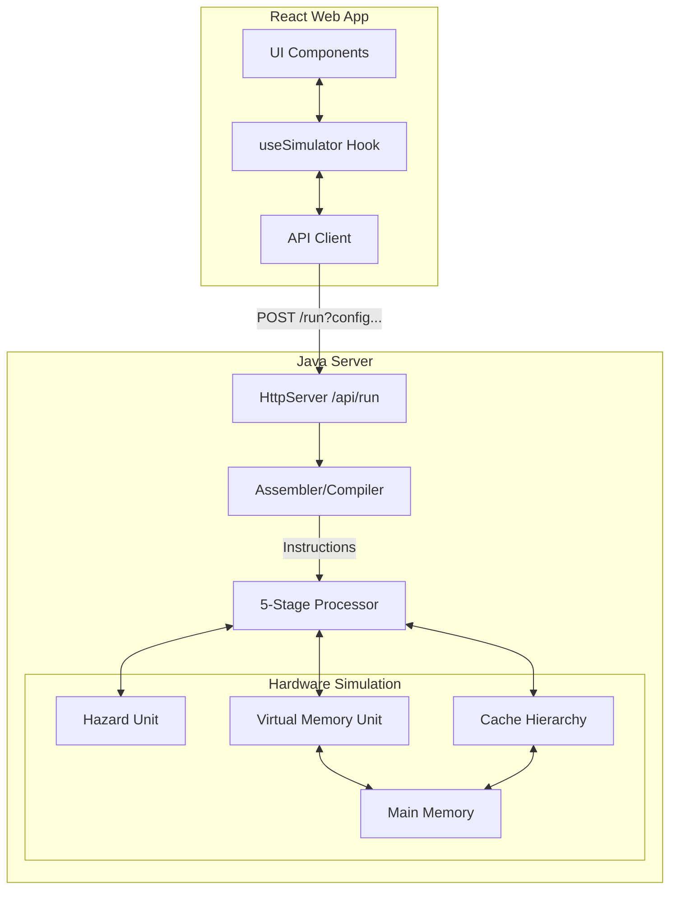

# RISC-V Simulator — Interview Q&A Prep (Resume-Driven)
### Format: Likely Question → Ideal Answer → Trap Follow-up

> The interviewer has your resume and the deployed web app. These are the exact phrases they will challenge.
> Each section gives you the question, a tight answer, and the follow-up trap to watch for.

---

## Architecture Overview

## Tech Stack Defense

**"Why did you choose Java for the backend simulator?"**
> "I chose Core Java 17 for a few reasons. First, object-oriented programming maps perfectly to hardware design — it's very natural to have classes for `RegisterFile`, `ALU`, and `CacheHierarchy`. Second, I wanted the backend to be completely dependency-free. By using Java's built-in `com.sun.net.httpserver.HttpServer`, I didn't need Spring Boot or any heavy web frameworks. The entire simulator compiles instantly and can run anywhere with a JRE."

**"Why React and TypeScript for the frontend?"**
> "A processor simulator has a lot of complex, interconnected state — when you toggle 'Data Forwarding' in the config, it needs to instantly update the API request payload, which then returns a new memory dump and stats payload that need to be rendered. React's declarative state management handles this flawlessly. I used TypeScript to ensure strict typing between the frontend and backend (for example, keeping the `SimConfig` interface exactly aligned with the Java parser) which eliminated an entire class of runtime bugs."

---

## Bullet 1: "Cycle-accurate 5-stage pipelined RISC-V simulator"

### They ask: *"What does 'cycle-accurate' actually mean? Why does it matter?"*

**Your answer:**
Cycle-accurate means every instruction takes exactly the correct number of clock cycles as it would in real hardware — including pipeline stalls from hazards, multi-cycle operations like MUL/DIV, and cache miss penalties. The alternative is a functional simulator, which just produces the correct register values without caring how many cycles it took. Cycle-accuracy is critical for performance analysis — IPC, CPI, and cache hit rates are meaningless without it.

**Trap follow-up:** *"How did you verify it was actually cycle-accurate?"*
> Validated against 10 trace workloads and a bubble sort program, cross-checking final register values against a memory dump and comparing IPC numbers across different cache configurations to confirm expected degradation patterns.

---

## Bullet 2: "25 instructions (21 native opcodes + 4 pseudo-instructions)"

### They ask: *"What are the 4 pseudo-instructions and why are they pseudo?"*

**Your answer:**
A pseudo-instruction is one the programmer writes but doesn't exist in the hardware ISA — the assembler silently translates it into a real instruction. My 4 pseudo-instructions include `LI` (Load Immediate), which becomes `ADDI rd, x0, imm`. They're pseudo because there's no dedicated opcode — they map directly to existing instructions. This keeps the hardware ISA minimal while making assembly programming more readable.

**Trap follow-up:** *"What major real RISC-V instruction does your ISA not support, and what can't you do because of it?"*
> The most significant missing instruction is `JALR` (Jump and Link Register). Without it, you can't implement function calls with a return address stored in a register, which means no proper function call/return pattern. The ISA only supports PC-relative `JAL` jumps, limiting programs to simple loops and linear code.

---

## Bullet 3: "Configurable 3-level cache hierarchy (L1I/L1D/L2)"

### They ask: *"Why split L1 into separate instruction and data caches?"*

**Your answer:**
A unified L1 would create a structural hazard — the IF stage (fetching the next instruction) and the MEM stage (reading/writing data) would compete for the same cache port every cycle. By splitting into L1I and L1D, both stages can access their respective caches simultaneously with no conflict. The trade-off is that total L1 capacity is effectively halved for any workload that is either pure compute or pure memory-bound.

**Trap follow-up:** *"What happens when both L1I and L1D miss on the same cycle?"*
> The MEM stage gets priority — its stall counter is decremented first because that instruction is older and further into the pipeline. The IF stage is held frozen until the MEM miss is fully serviced. This correctly models the memory bus arbitration where only one request can go to L2 at a time.

---

## Bullet 4: "Fully-associative 16-entry DTLB"

### They ask: *"What is a DTLB and why is it needed?"*

**Your answer:**
The DTLB (Data Translation Lookaside Buffer) is a small, fast cache for virtual-to-physical address translations. Without it, every memory access (`LW`, `SW`) would require a page table walk — reading the page table from RAM — before even touching the actual data. That would double the memory latency for every data access. The DTLB caches the 16 most recent translations so they complete in 1 cycle instead of requiring a full page table walk.

**Trap follow-up:** *"What's the difference between a TLB miss and a page fault?"*
> A TLB miss means the translation isn't cached in the TLB — but the page is still in RAM. The VMU walks the page table, finds the physical frame number, and refills the TLB. A page fault means the page itself is not in RAM at all — it's been swapped out to `swap.txt`. The VMU must find a victim frame (using LRU), potentially write the dirty frame to swap, load the requested page from swap into RAM, update the page table, and then refill the TLB.

---

## Bullet 5: "Virtual memory subsystem with swap-space persistence"

### They ask: *"How does your swap space work?"*

**Your answer:**
Physical RAM in the simulator has 32 frames (128KB). The virtual address space covers 64 pages (256KB). When all 32 frames are occupied and a new page is needed, the VMU evicts the least-recently-used frame. If that frame's dirty bit is set — meaning the CPU wrote to it — its contents are serialized to `swap.txt` on disk before eviction. When that page is later accessed again, it's loaded back from `swap.txt` into a frame, restoring the exact data the program wrote.

**Trap follow-up:** *"Why do you have to invalidate the cache when you evict a frame from RAM?"*
> The caches use physical addresses (PIPT). If frame 5 gets evicted and a new page is loaded into frame 5, the cache might still hold stale data tagged with frame 5's physical address from the old page. If the CPU reads that address, it would get a cache hit but return the old, wrong data. Calling `invalidateFrame()` flushes all cache lines associated with that physical frame before loading the new page, preventing this stale-data bug.

---

## Bullet 6: "BTFNT static branch prediction with 2-cycle flush on misprediction"

### They ask: *"What is BTFNT and why is it a good heuristic?"*

**Your answer:**
BTFNT stands for Backward Taken, Forward Not Taken. Backward branches — where the jump target is a lower PC address — are almost always loop back-edges, and loops repeat far more often than they exit. So predicting them as always-taken is statistically correct the majority of the time. Forward branches — where the target is a higher PC — are usually if-else exits, which go "not taken" most of the time. This heuristic requires zero runtime history and no hardware tables, yet achieves reasonable accuracy for typical programs.

**Trap follow-up:** *"Why is the flush exactly 2 cycles?"*
> The branch is decoded in ID (cycle N), executed and evaluated in EX (cycle N+1). During those 2 cycles, IF has already fetched the next instruction and ID has decoded it. Both of those instructions are wrong. So on misprediction, both the IF/ID and ID/EX pipeline registers are flushed to NOP bubbles, and the PC is redirected to the correct address.

---

## Bullet 7: "Data forwarding and load-use hazard stall logic"

### They ask: *"What is data forwarding and what problem does it solve?"*

**Your answer:**
When an instruction produces a result that the very next instruction needs, that result won't be in the register file until WB — 3 stages later. Without forwarding, the pipeline would have to stall for 2 cycles waiting for the value. Forwarding bypasses the register file by routing the result directly from the EX/MEM or MEM/WB pipeline register back into the ALU input of the following instruction, eliminating the stall entirely.

**Trap follow-up:** *"When can't forwarding help — what is a load-use hazard?"*
> A load-use hazard is a `LW` immediately followed by an instruction that uses the loaded value. `LW` doesn't produce its value until the end of the MEM stage. But the next instruction needs that value at the start of *its* EX stage — which is one cycle before MEM completes. Forwarding can't travel back in time, so the pipeline must insert one stall cycle to let `LW` finish MEM before the consumer enters EX.

---

## Bullet 8: "IPC ranging from 0.164 to 0.027 on adversarial traces"

### They ask: *"Why is IPC so low — 0.164 at best? Shouldn't a 5-stage pipeline give IPC close to 1.0?"*

**Your answer:**
IPC of 1.0 is the theoretical maximum for a single-issue in-order pipeline — one instruction retiring per cycle. In practice, three things drag it down. First, pipeline startup and drain cost 4 cycles every program. Second, branch mispredictions flush 2 instructions each time. Third — and most dominant in our traces — cache misses cause multi-cycle stalls. A trace with 0% L1D hit rate stalls for every single load/store, waiting for L2 or RAM. The 0.027 adversarial trace has both a 0% TLB hit rate and maximum cache miss rate, stacking TLB walk latency on top of cache miss latency on every memory instruction.

**Trap follow-up:** *"What is CPI and how does it relate to IPC?"*
> CPI (Cycles Per Instruction) is simply 1/IPC. An IPC of 0.164 means CPI ≈ 6.1 — every instruction takes on average 6.1 cycles to complete. For the adversarial trace at IPC 0.027, CPI ≈ 37 — almost every instruction is stalled for 37 cycles waiting on the memory hierarchy.

---

## Bullet 9: "Configurable LRU/FIFO replacement at all three levels via a single config parameter"

### They ask: *"What is the difference between LRU and FIFO replacement? When would FIFO outperform LRU?"*

**Your answer:**
LRU evicts the line that was least recently used — it keeps the working set in cache as long as it's actively referenced. FIFO evicts the oldest line regardless of how recently it was used. LRU is almost always better for temporal locality workloads. FIFO can outperform LRU in a specific case called "LRU thrashing" — when a cyclic access pattern is slightly larger than the cache. FIFO avoids the pathological case where LRU evicts the exact line it's about to need next. Making this configurable via a single `config` parameter lets users benchmark both policies against the same trace without changing any simulation logic.

---

## Bullet 10: "L1D hit rates from 99.7% to 0% on stride-8 access patterns"

### They ask: *"Why does a stride-8 access pattern cause 0% hit rate?"*

**Your answer:**
"A stride-8 pattern in this context refers to a stride of 8 memory pages (32KB apart). Because our L1D cache is exactly 4KB in size and direct-mapped, any two addresses that are a multiple of 4KB apart will mathematically map to the exact same cache set. When the program accesses an address, and then jumps 32KB away to access the next address, both accesses target the same set index. They continuously conflict and evict each other before they can be reused, resulting in a 0% hit rate. This demonstrates the classic conflict-miss vulnerability of direct-mapped caches."

**Trap follow-up:** *"How would increasing associativity fix this?"*
> With a 2-way set-associative cache, two conflicting addresses can coexist in the same set in different ways, eliminating the conflict eviction. Both lines stay in cache simultaneously, turning repeated misses into hits.

---

## Bullet 11: "Trace-driven performance analytics engine reporting IPC, CPI, cache hit/miss rates, branch mispredictions, TLB statistics, and dirty page eviction counts"

### They ask: *"What does this actually mean in plain English?"*

**Your answer:**
At its core, this bullet means: **I built a system that plays back a recording of a real program's memory accesses, and while doing that, it measures how well the simulated hardware performed.**

**Breaking it down piece by piece:**

**"Trace-driven"** — Instead of writing assembly code yourself, you feed the simulator a *trace file* — a pre-recorded log of every instruction and memory address a real program touched during its actual execution. The simulator just replays this recording. The advantage is that you can take the exact same real-world workload and test it against completely different hardware configurations (different cache sizes, different replacement policies) without needing to re-run the original program.

**"Performance analytics engine"** — After replaying the trace, the simulator prints out a full performance report. Here's what each metric means:

- **IPC (Instructions Per Cycle)** — How many instructions finished in each clock cycle on average. Higher is better. A perfect pipeline with no stalls would be 1.0. Our simulator often got 0.06 IPC due to load-use stalls and cache misses.
- **CPI (Cycles Per Instruction)** — Just the inverse of IPC (CPI = 1/IPC). Tells you how many cycles each instruction cost on average.
- **Cache hit/miss rates** — Out of all the times the CPU went to fetch data from memory, what percentage were already sitting in the fast L1/L2 cache (hit) vs had to go all the way to slow main RAM (miss). A 0% hit rate means every single memory access paid the full 10-cycle memory penalty.
- **Branch mispredictions** — Every time the CPU predicted the wrong outcome for a branch instruction (e.g., it guessed a loop wouldn't jump, but it did), two instructions already in the pipeline had to be thrown away and the pipeline flushed. This counter tracks how many times that happened.
- **TLB statistics** — The TLB (Translation Lookaside Buffer) is a tiny 16-entry cache that stores recently-used virtual-to-physical address translations. A TLB hit costs 1 cycle; a TLB miss means the CPU has to do a full page table walk (10 cycles); a page fault means it has to load the page from swap disk (50 cycles). These stats show the breakdown.
- **Dirty page eviction counts** — When the simulator runs out of physical RAM (256 KB) and needs to load a new page, it must evict an old one. If that old page had been written to (modified / "dirty"), it has to be saved to the swap file on disk first before being evicted. This counter tracks how many of those costly disk writes happened.

**Why is this useful?** It lets you answer questions like: "If I double the L1 cache size, does the miss rate drop enough to justify the extra hardware cost?" You replay the exact same trace against both configurations and compare the numbers directly.

---

## What They'll See on the Deployed App — Likely Demo Questions

**"I see a code editor — what can I type in there?"**
> It's an assembly editor that accepts our custom RISC-V-like ISA. You can type instructions like `ADDI x1, x0, 5` or `BEQ x1, x2, label`, hit Run, and the backend compiles it, simulates it cycle by cycle, and returns the full performance statistics — IPC, cache hit rates, stall counts — in the dashboard.

**"What's the Trace Replay section?"**
> Instead of writing assembly manually, you can upload a pre-recorded trace file. The simulator replays those instructions against a configurable memory hierarchy and produces performance analytics. This is what we used for the 10-workload benchmarking on the resume.

**"What config options do you expose?"**
> Cache sizes, associativity, block size, replacement policy (LRU vs FIFO), whether forwarding is enabled, and whether each cache level is active. Disabling forwarding and comparing IPC is a good demo — it shows how much stalling impacts performance.

**"Can I see a misprediction happening?"**
> Write a forward branch (like an if-statement) with a taken path — BTFNT predicts it not-taken, so it mispredicts. The stats will show a non-zero branch flush count and slightly lower IPC than an equivalent program with no branches.
